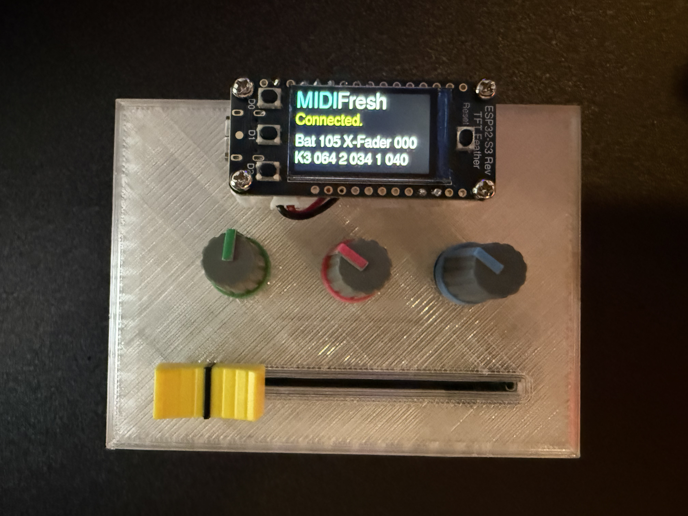

<h1>MIDIFresh </h1>

Is a pocket DJ mixing console using MIDI over Bluetooth low energy. I use it with Traktor Pro 4 but it should work with almost any DJ software that allows MIDI Mappings for a controller. 

The project uses an Adafruit ESP32-S3 Reverse TFT Feather Microcontroller at the heart and then some simple 10k potentiometers for cross fader and knobs. The microcontroller board has some buttons built in which are also utilized. 

There are included .stl files to print the case my design is simple and a bit steam punk with the microcontroller on the external side.  Likely a nicer case could be produced. 

<h3>Parts List. </h3>
<pre>
3 X 10k rotary potentiometer. (linear) 
1 X 10k slider/fader type potentiometer (linear) 
Adafruit ESP32-S3 Reverse TFT Feather – 4MB 
3 plastic knobs
1 plastic fader knob. 
3.2v LIPO that will fit in the case. 
</pre>

<h3>Construction</h3>

The case can be printed in 3 parts and superglued together. I glued in the fader, The knobs and fader should all be connected to analogue pins on the microcontroller with +3v and 0v connected to each side and the LIPO connected to the DC/Bat port. 

There are some simple adjustments that can be done in the code that allows the use of different pins. Should be self-explanatory. 

